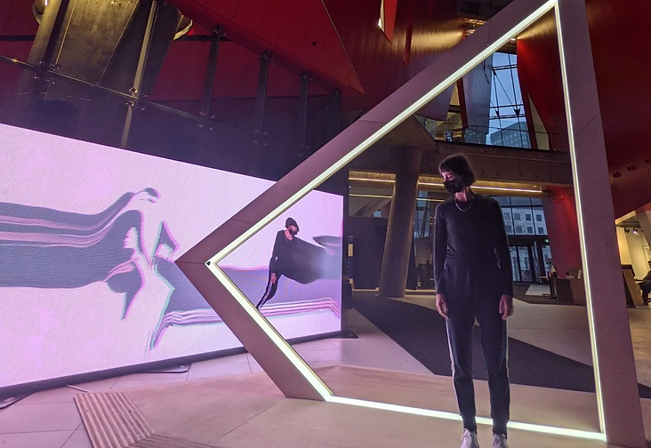
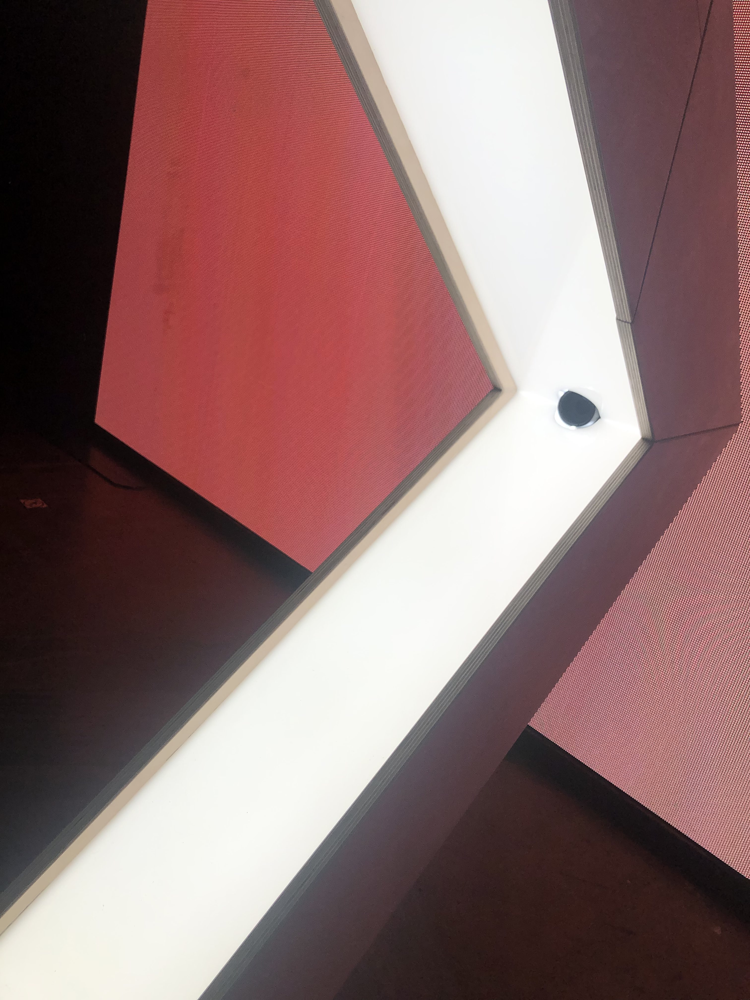
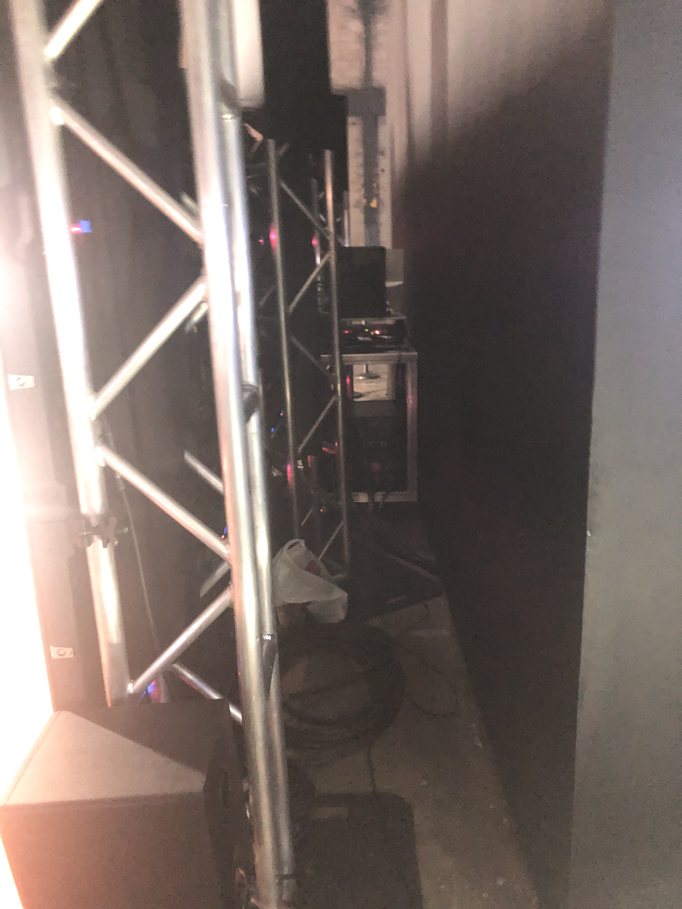
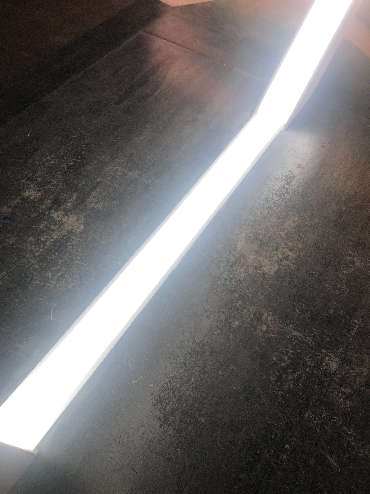
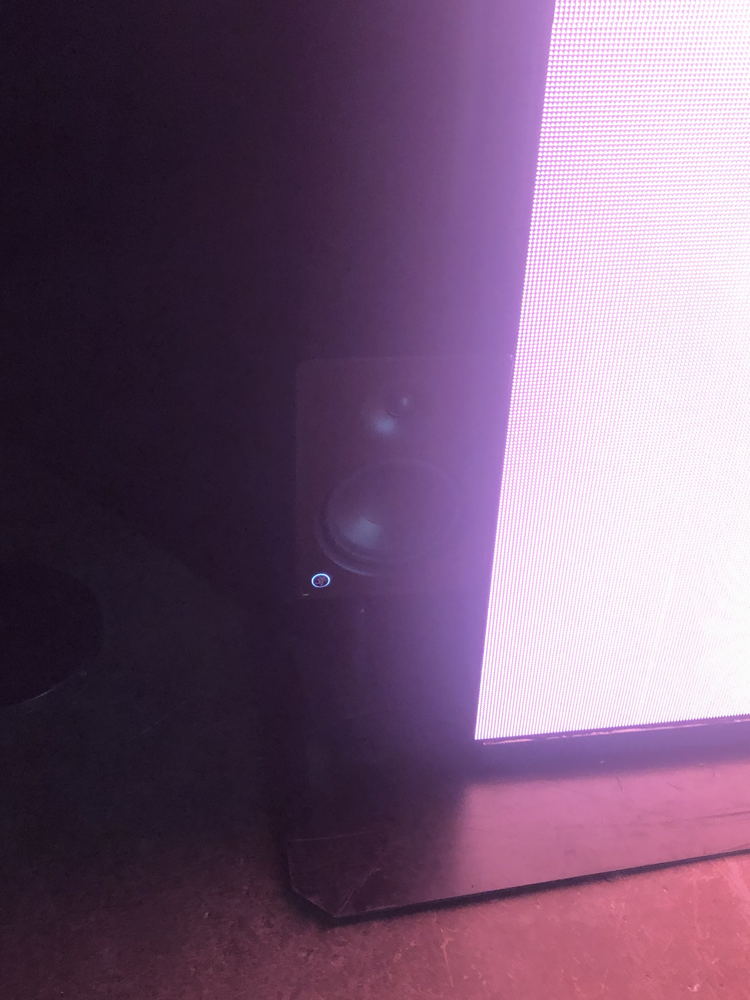

### Resonances ###
- Lieu: Arsenal 
- Type d'exposition: Exposition permanante 
- Titre de l'oeuvre: Résonances 

- Nom de l'artiste: Louis-Philippe Rondeau
- Année de réalisation: 2022
- Description de l'oeuvre: Une arche de lumiere qui vous capture et vous affiche à l'écran quand vous passez dedans.
- Type d'oeuvre: oeuvre intéractive

https://user-images.githubusercontent.com/112189897/219528625-0d549634-cb53-47ad-b71f-83e22588222c.mov
- Plan de l'oeuvre: un triangle lumineux devant un grand écran.
- Composantes et techniques: caméra et circuis

- Éléments nécessaires à la mise en exposition: écran, lumière pour bien éclairer le sujet et haut-parleur.

- Expérience vécue: de drôles de photos, car plus on reste longtemps dans l'arche, plus l'image affichée est étirée.
- Ce qui m'a plu: le fait de pouvoir jouer avec la largeur de l'image pour faire des effets à l'écran.
- Aspect que je ferais autrement: je changerais l'angle de la caméra ou ajouterais une deuxième caméra en bas de l'arche, car souvent, le bas des photos était déformé et étrange.
