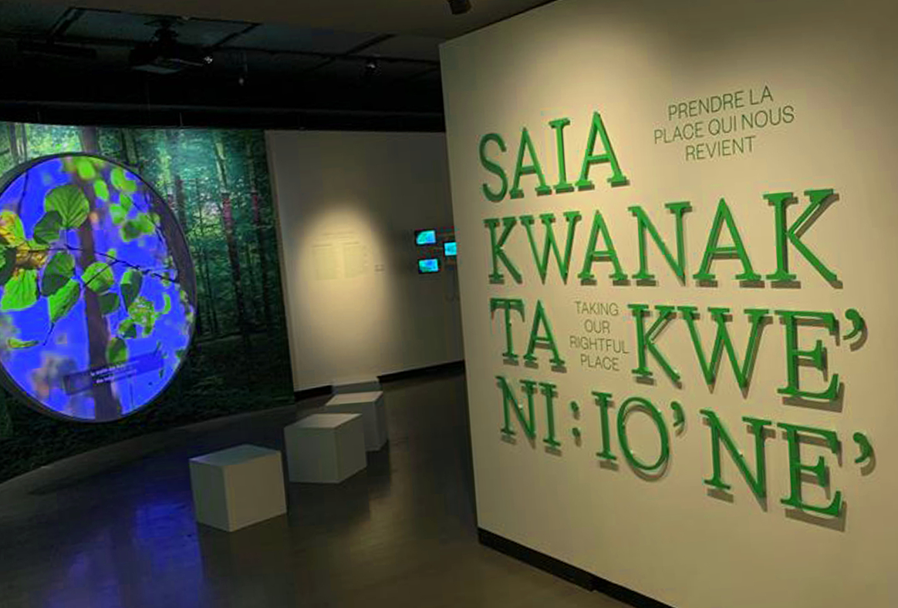

# VOIX AUTOCHTONES D’AUJOURD’HUI #

## Lieu de mise en exposition ##

- L'exposition se retrouve au musée Mccord à Montréal.

## Type d'exposition ##

- Cette exposition permanente est là depuis le 25 septembre 2021.

## Date de visite ##

- Mardi 11 avril 2023.

## Titre de l'oeuvre ##

- VOIX AUTOCHTONES D’AUJOURD’HUI

## Nom des artistes ##

Il y a beaucoup trop d'artiste impliqués pour tous les nommer, mais l'exposition à été réalisée par Suzanne Sauvage.

## Année de réalisation ##

- 2021

## Description de l'oeuvre ##

- Un pilier recouvert de feuilles et de végétation qui rappelle la forêt. Ce pilier intéractif a quatre côtés différents ayant chacun une couleur différente. Chaque côté, quand un mouvement est détecté en face, change de couleur et joue une mélodie différente des autres.

## Type d'installation ##

- Installation immersive

## Mise en espace ##

- L'oeuvre est placée sur le sol et reste en place grâce à une plaque fixée à la base de l'oeuvre. 

## Composantes et techniques ##

- Un ordinateur qui contrôle les couleurs et le sons grâce aux logiciels utilisés.
- Des speakers qui servent à émmetre le son.
- Des capteurs de mouvement afin de pouvoir détecter si quelqu'un passe devant un côté de l'oeuvre et de dire à l'ordinateur de changer les couleurs et de jouer une mélodie. 

## Éléments nécessaires à la mise en exposition ##

- Une plaque fixée à la base de l'oeuvre afin de la faire tenir debout.
- Des cache fils afin de cacher et de protéger les fils pour pas que quelqu'un pile sur ceux-ci.
- Des projecteurs afin de bien illuminer l'oeuvre le soir.

## Expérience vécue ##

- Quand je suis allé tester l'oeuvre, elle était encore en développement, cependant, je n'ai pas remarqué de défaut et tout fonctionnait à merveille. J'ai passé devant chaque côté de l'oeuvre et tous offraient une ambiance différente. Les couleurs changeaient autant que les mélodies, les artistes ont réussi à rendre leur oeuvre immersive. Toutefois, quand j'ai testé cette oeuvre, j'étais dans le studio et la lumière était ouverte. Maintenant que l'oeuvre est dehors, je conseille à ceux qui veulent aller la tester d'y aller quand le soleil est couché, car je pense que d'essayer cette oeuvre dans le noir rendrait cette oeuvre encore plus immersive.

## ❤️ Ce qui m'a plu ##

- J'ai choisi cette oeuvre car c'était d'après moi la plus interressante parmis toutes les autres. Ce qui m'a plu de cette oeuvre, c'est l'immersion. J'avais l'impression d'être dans un autre monde en essayant cette oeuvre, surtout grâce à la musique. LA musique était appaisante, calme et me donnait envie de me coucher et de fermer les yeux. Les lumières me donnaient l'impression d'être dans une forêt magique et la musique à beaucoup accentué ce sentiment. 

## 🤔 Point à améliorer ##

- La seule chose que je changerait pour cette oeuvre serait d'essayer de la rende un peut moins répétitive. Par exemple, ajouter quelques sons et couleurs et les rendre aléatoire afin de donner plus d'options.
