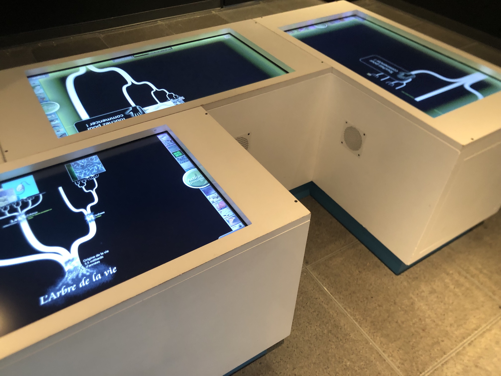
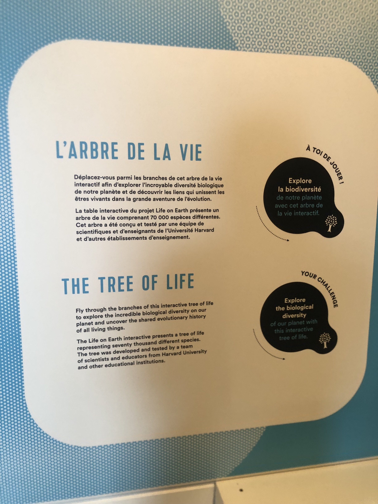

# Sortie au centre des sciences #

## Date de visite ##

- Vendredi 28 avril 2023

## Type d'exposition ##

- Permanente et intérieure

## Titre de l'oeuvre ##

- L'arbre de la vie

## Description du dispositf ##

- Des écrans intéractifs qui affiche un arbre qui nous permettent de voir l'évolution des éléments et des espèces de notre planète en se déplacant vers les branches de l'arbre.

## Type d'installation ##

- Ce dispositif est une installation intéractive, car pour que l'oeuvre fonctionne, la personne doit utiliser l'écran afin de se promener et d'en apprendre d'avantage sur l'évolution.

## Fonction du dispositif ##

- Le but de cette oeuvre est d'en apprendre aux gens sur l'évolution. Avec plusieurs éléments et espèces, les gens peuvent en apprendre d'avantage toyt en s'amusant en avancant sur les branches de l'arbre afin de voir l'évolution d'un élément ou d'une espèce.
