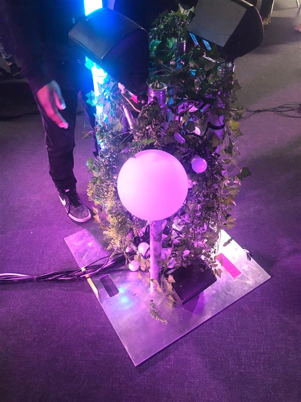

# EDRIA #

## Lieu de mise en exposition ##

L'exposition se retrouve dehors à côté de l'anex.

## Type d'exposition ##

Cette exposition est temporaire, car elle ne peut pas rester sur le terrain de l'école indéfiniment afin de laisser la place aux prochains étudiants.

## Date de visite ##

Vendredi 10 mars 2023

## Titre de l'oeuvre ##

EDIRA

