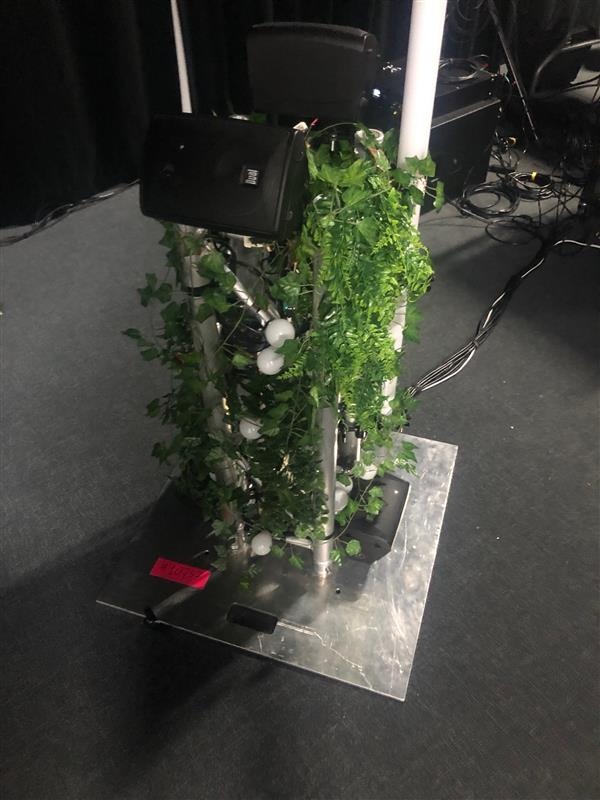

# EDRIA #

## Lieu de mise en exposition ##

- L'exposition se retrouve dehors à côté de l'anex.

## Type d'exposition ##

- Cette exposition est de type temporaire, car elle ne peut pas rester sur le terrain de l'école indéfiniment afin de laisser la place aux prochains étudiants.

## Date de visite ##

- Vendredi 10 mars 2023

## Titre de l'oeuvre ##

- EDIRA

## Nom des artistes ##

- Elwin Durand
- Loic Delorme
- Dominic Roberts
- Gabriel Leblanc
- Meryem Berbiche
- Jean-Christophe

## Année de réalisation ##

- 2023

## Description de l'oeuvre ##

- Un pilier recouvert de feuilles et de végétation qui rappelle la forêt. Ce pilier intéractif a quatre côtés différents ayant chacun une couleur différente. Chaque côté, quand un mouvement est détecté en face, change de couleur et joue une mélodie différente des autres.

## Type d'installation ##

- Installation immersive

## Mise en espace ##

- L'oeuvre est placée sur le sol et reste en place grâce à une plaque fixée à la base de l'oeuvre. 
