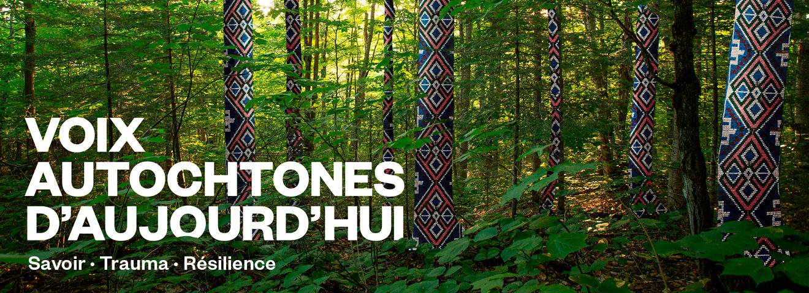
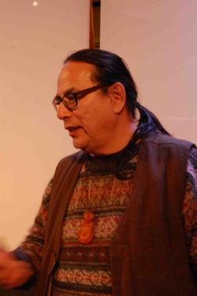
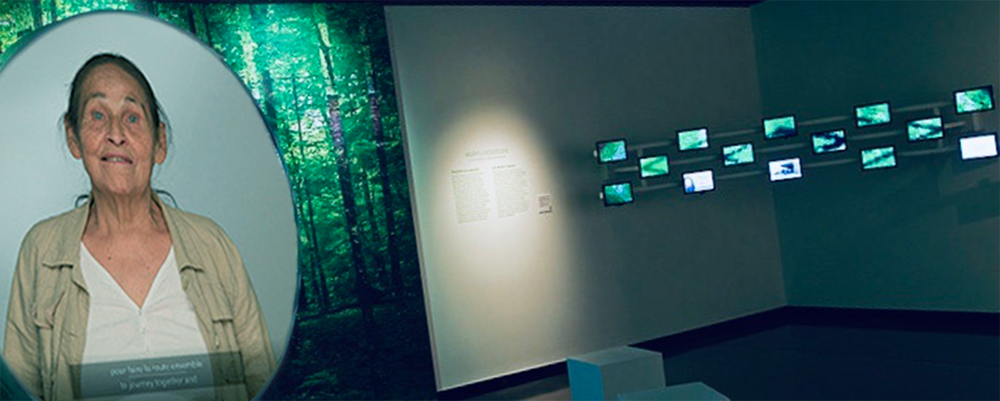
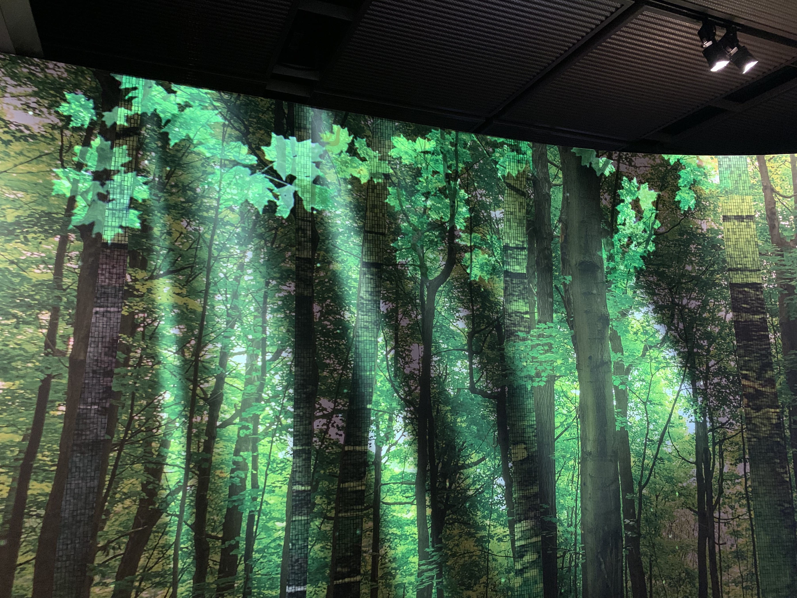
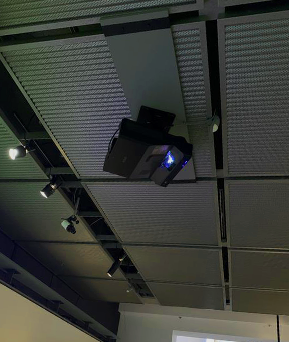
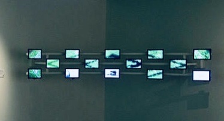
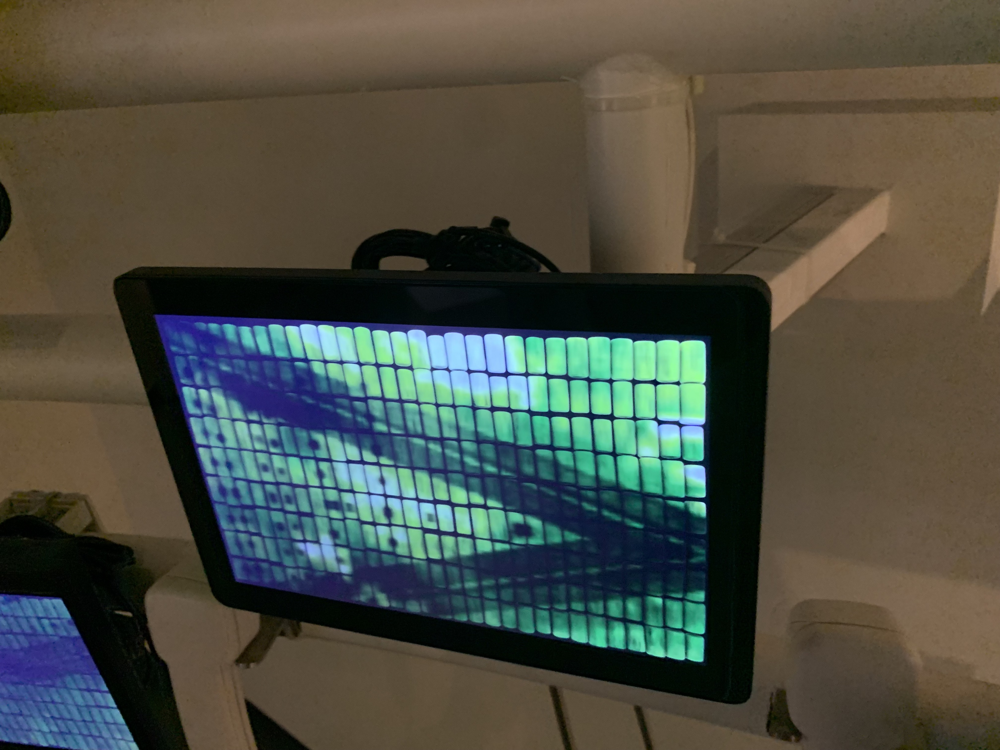

# Voix autochtones d'aujourd'hui: savoir, trauma et résilience #

## Lieu de mise en exposition ##

- L'exposition se retrouve dans le Musée McCord Stewart à Montréal.

## Type d'exposition ##

- Cette exposition est de type permanente et est à l'intérieur depuis le 24 décembre 2021.

## Date de visite ##

- Mardi 11 avril 2023

## Titre de l'oeuvre ##

- Voix autochtones d'aujourd'hui: savoir, trauma et résilience

## Nom des artistes ##

Jean St-Onge et Elisabeth Kaine

 

## Année de réalisation ##

- 2021

## Description de l'oeuvre ##

- Cette exposition met en avant la collaboration entre les personnes autochtones et allochtones (personnes non-autochtones) avec plusieurs vidéos et témoiniages projettées afin de lutter contre les injustices et dans le but de guérir les blessures du passé causées aux autochtones. Cette oeuvre a pour but de faire sentir au visiteur qu'il a eu une réelle rencontre et de dialogue avec les gens dans cette oeuvre en écoutant leurs témoigniages et leurs façons de s'impliquer pour lutter contre les injustices actuelles.

## Type d'installation ##

- Installation immersive et contemplative

## Mise en espace ##

- L'oeuvre placée dans une pièce et est dispersée en plusieurs éléments. En premier lieu, il y a un fond qui projette une forêt afin de nous immerser dans l'oeuvre. Devant ce fond, il y a l'écran qui sert a montrer les témoignages de personnes autochtones, cet écran est blanc et les vidéos sont projettées sur cet écran grâce à un projecteur. À la droite de cet ecran, il ya a d'autres petits écrans qui montrent eux aussi des témoignages de différentes personnes que l'on peut écouter avec des téléphones. De l'autre côté, il y a des objets qui représentent l'héritage autochtone et son histoire.

## Composantes et techniques ##

- Projecteur
- Dispositif (qui affiche les vidéos)
- Petits écrans
- Téléphones

## Éléments nécessaires à la mise en exposition ##

- Des lumières afin de bien éclairer les oeuvres.
- Des cache fils afin de protéger et cacher les fils pour rendre les oeuvres plus belles.
- Des haut-parleurs afin d'émettre le son des témoignages.

## Expérience vécue ##

- Quand je suis sorti du musée après ma visite, j'ai eu l'impression d'avoir eu une discussion avec tous ces gens qui faisaient les témoignages. Leurs histoires étaient touchantes et m'ont fait réfléchir sur mon chemin du retour à comment les injustices sont toujours présentes chez les peuples autochtones de nos jours.

## ❤️ Ce qui m'a plu ##

- J'ai choisi cette oeuvre car c'était d'après moi la plus interressante parmis toutes les autres. Ce qui m'a plu de cette oeuvre, c'est l'immersion. J'avais l'impression d'être dans un autre monde en essayant cette oeuvre, surtout grâce à la musique. LA musique était appaisante, calme et me donnait envie de me coucher et de fermer les yeux. Les lumières me donnaient l'impression d'être dans une forêt magique et la musique à beaucoup accentué ce sentiment. 

## 🤔 Point à améliorer ##

- La seule chose que je changerait pour cette oeuvre serait d'essayer de la rende un peut moins répétitive. Par exemple, ajouter quelques sons et couleurs et les rendre aléatoire afin de donner plus d'options.
